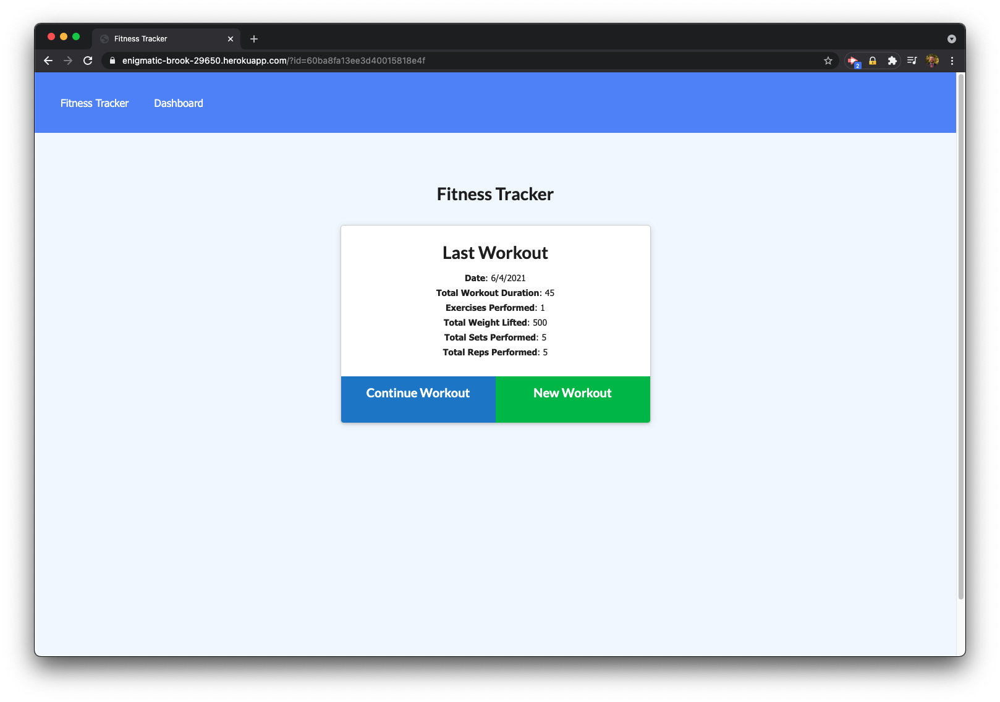
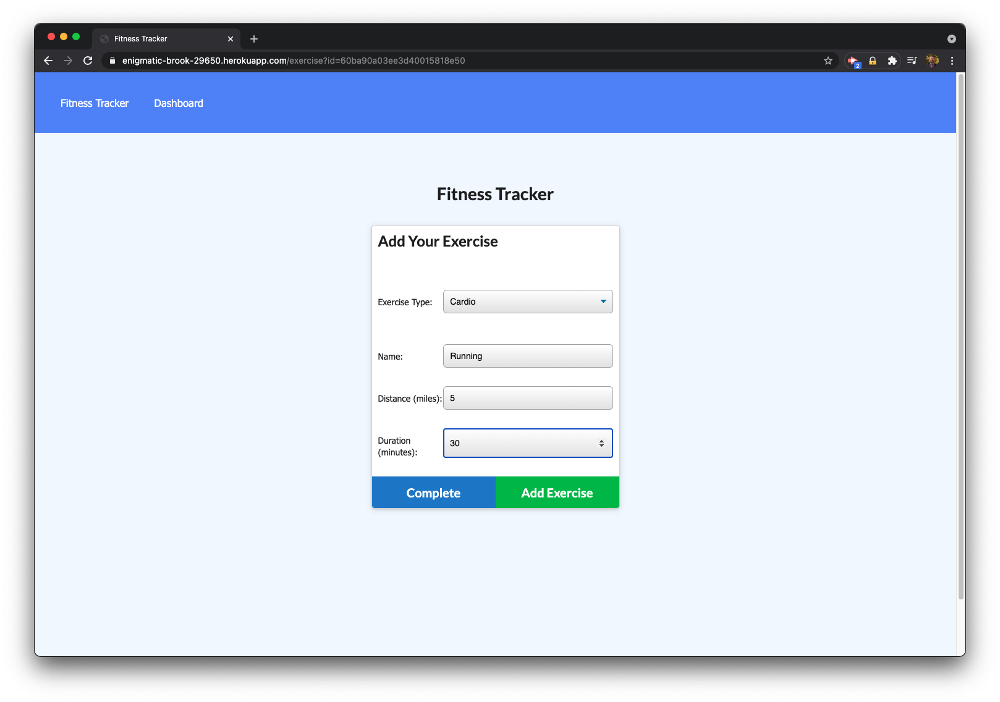
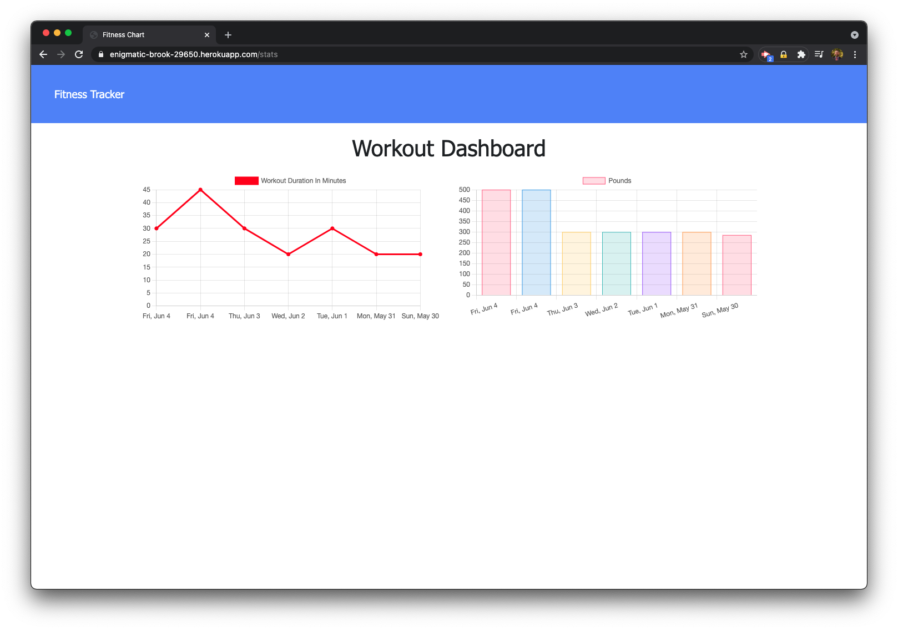

# Fitness Tracker

## Description

Fitness Tracker allows users to add a workout or update an existing workout with exercises they've completed. The app tracks your activity over time and includes graphs that display workout duration (in minutes) and how many pounds you lifted during your workouts. Frontend code provided. Wrote the API to deliver frontend files and the API to handle database requests. Uses Node.js, MongoDB Atlas, Mongoose, and Express.

## Table of Contents

- [Installation](#installation)
- [Usage](#usage)
- [Contribute](#contribute)
- [Test](#test)
- [License](#license)
- [Questions](#questions)

## Installation

Clone the repo, set up the database, and run the seed file to get started.

## Usage

Simply navigate to HEROKU URL and start adding or modifying workouts.

## Contribute

Feel free to offer suggestions for how I could improve the code or add new features.

## Test

Try adding or updating workouts and see if the data persists and is stored and displayed properly.

## License

Copyright (c) Sam Gates. All rights reserved.
Licensed under the [MIT](https://opensource.org/licenses/MIT) license.

## Questions

Check out my [GitHub Profile](https://github.com/sg0703).

Email with questions! You can reach me at sam.j.gates@gmail.com.
